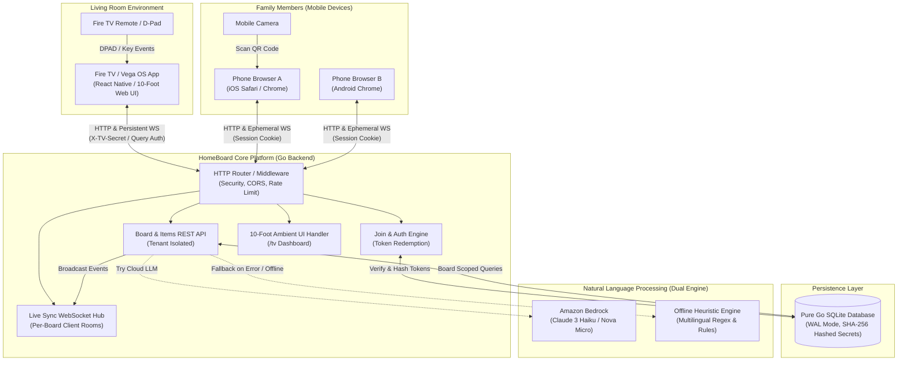
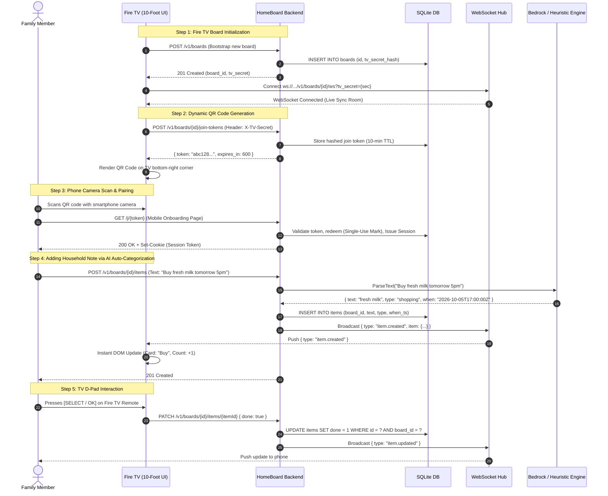
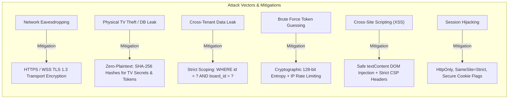
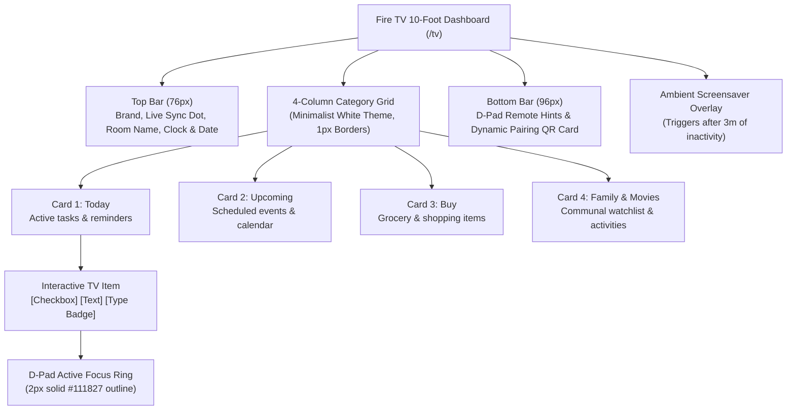
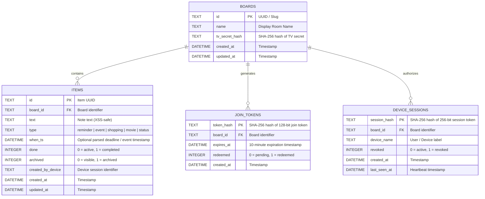
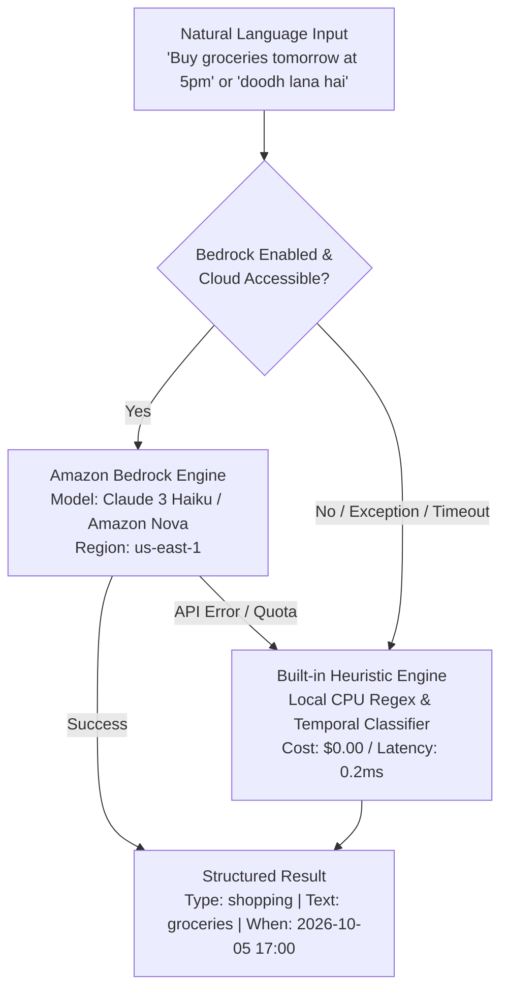

# HomeBoard — System Architecture & Design Specification

> Visualized architectural blueprint of **HomeBoard**: an ambient household display engineered for Amazon Fire TV / Vega OS, phone QR pairing, WebSocket live synchronization, and Amazon Bedrock NLP.

---

## 1. High-Level System Architecture

---

## 2. End-to-End User Flow & Sequence

The diagram below details the complete lifecycle from television initialization and QR pairing to real-time synchronization and D-pad interaction:

---

## 3. Security Architecture & Threat Model

HomeBoard is engineered according to the **OWASP Top 10 (2025)** and **AWS Well-Architected Security Pillar**:

### Key Security Safeguards
1. **Zero Plaintext Secrets**: Raw tokens are generated using `crypto/rand`, delivered once to the client, and immediately hashed using `crypto/sha256` before database insertion. Constant-time comparison (`subtle.ConstantTimeCompare`) prevents timing attacks.
2. **Ephemeral Join Tokens**: QR tokens expire within 10 minutes and are single-use. The TV screen automatically rotates the token every 8 minutes.
3. **Tenant Boundary Enforcement**: Boards are logically isolated. Database updates, reads, and deletes require compound primary keys matching both the board identifier and the item identifier.
4. **Device Revocation**: The TV maintains master authorization to revoke any paired smartphone session instantaneously, which immediately severs the active WebSocket connection.

---

## 4. 10-Foot TV UI Component Hierarchy

The TV interface is optimized for television viewing distances (3 meters / 10 feet), featuring a clean, minimalist design with high-contrast elements:

---

## 5. Entity-Relationship Data Model

The database runs on embedded **pure Go SQLite** (`modernc.org/sqlite`) in Write-Ahead Logging (WAL) mode:

---

## 6. AI Dual-Engine Architecture

HomeBoard implements a fault-tolerant dual natural language engine ensuring 100% operational uptime regardless of cloud availability:

