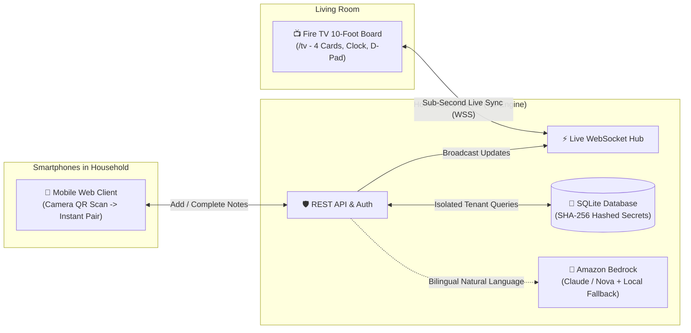

# HomeBoard 📺 📱

> **A privacy-first, ambient communal household board for Amazon Fire TV / Vega OS with instant phone QR pairing, sub-second WebSocket live synchronization, and Amazon Bedrock natural language understanding.**

[](LICENSE)
[](https://go.dev/)
[](https://developer.amazon.com/fire-tv)
[](https://aws.amazon.com/bedrock/)
[]()

---

## 🌟 Why HomeBoard?

Living rooms have large television screens that sit idle for hours. Existing digital family boards suffer from three critical flaws:
1. **Clunky TV Text Input:** Typing notes, grocery lists, or reminders with a TV remote on an on-screen keyboard is slow and frustrating.
2. **Account Fatigue & Privacy Risks:** Forcing family members or houseguests to download an app and log into personal accounts on a shared television leads to security vulnerabilities and high friction.
3. **No Ambient Awareness:** Traditional apps demand active attention rather than providing a glanceable, beautiful ambient experience that blends into your home.

**HomeBoard solves this completely:**
* **Glanceable 10-Foot UI:** A clean, minimalist layout with high contrast readable from across the room.
* **Instant Phone QR Pairing:** Anyone in the home scans the TV screen's rotating QR code with their mobile camera to open a web app—**zero downloads, zero account setup**.
* **Sub-Second Live Sync:** Adding or completing an item on your phone updates the Fire TV screen in real time over authenticated WebSockets.
* **Dual-Engine AI:** Type or speak natural language (*"Buy fresh milk tomorrow at 5pm"* or *"doodh lana hai"*), and the built-in parser automatically categorizes the item into the correct card with dates and deadlines.

---

## 📸 System Architecture & Visual Design

For in-depth architectural specifications and sequence diagrams, refer to **[`ARCHITECTURE.md`](ARCHITECTURE.md)**.



---

## ✨ Features Overview

| Feature | Description |
| :--- | :--- |
| **📺 10-Foot Fire TV Experience** | Designed specifically for TV viewing distance with pure white minimalist cards (*Today, Upcoming, Buy, Family & Movies*). |
| **🎮 Full D-Pad Remote Navigation** | Navigate items using the Fire TV remote D-pad, press **[OK/Select]** to complete, or hold **['A']** to archive. |
| **📱 Zero-Friction QR Pairing** | Rotating 128-bit QR code on the TV lets any smartphone join in seconds without downloading an app. |
| **⚡ Sub-Second Live Sync** | Real-time bi-directional synchronization powered by an efficient Go WebSocket hub. |
| **🧠 Dual-Engine NLP (English + Hinglish)** | Powered by **Amazon Bedrock** with an automatic offline heuristic fallback—meaning it **always works** even without internet or cloud keys. |
| **🌙 Ambient Idle Screensaver** | Automatically transitions into an elegant, high-contrast clock screensaver after 3 minutes of inactivity. Wakes instantly on any remote click. |
| **🔒 Enterprise Security** | OWASP 2025 compliant: zero-plaintext secrets stored, constant-time hash comparisons, strict board tenant isolation, and XSS immunity. |

---

## 🚀 Quick Start (Local Setup in 60 Seconds)

### Prerequisites
* **Go 1.24+** (tested on Go 1.24, 1.25, 1.26)
* *(Optional)* **Docker & Docker Compose**

### Step 1: Clone the Repository
```bash
git clone https://github.com/kuldeep-poonia/homeboard.git
cd homeboard
```

### Step 2: Run the Server
```bash
cd backend
go run ./cmd/server
```
You will see:
```text
Starting HomeBoard server...
Connected to database at ./homeboard.db
WebSocket live-sync hub started
HomeBoard listening on 0.0.0.0:8080 (Environment: development)
```

### Step 3: Open the Fire TV Interface
Open your browser (or Fire TV Silk browser) to:
👉 **[`http://localhost:8080/tv`](http://localhost:8080/tv)**

* You will see the 4 category cards (*Today*, *Upcoming*, *Buy*, *Family & Movies*), live clock, and a dynamic pairing QR code in the bottom corner.

### Step 4: Pair Your Phone
1. Scan the QR code displayed on the TV screen with your phone camera (or open `http://localhost:8080/j/`).
2. Type any task, reminder, or grocery note (e.g., *"Buy milk tomorrow at 5pm"* or *"Movie night on Friday"*).
3. Click **Add Item** (or press Enter).
4. Watch the item appear **instantly on your TV screen** with zero delay!

---

## 🎮 Fire TV Remote & D-Pad Keybindings

HomeBoard is fully controllable using standard Fire TV / Android Leanback remote controls or your computer keyboard:

| Remote Button | Keyboard Key | Action |
| :--- | :--- | :--- |
| **D-Pad Down** | `↓` (Arrow Down) | Move focus to the next item |
| **D-Pad Up** | `↑` (Arrow Up) | Move focus to the previous item |
| **Select / OK** | `Enter` or `Space` | Toggle item complete (✓ Mark Done) |
| **Menu / Play** | `'A'` or `Backspace` | Archive selected item |
| **Any Button** | Any key | Dismiss ambient idle screensaver and wake the board |

---

## 🐳 Running with Docker

You can run the entire HomeBoard stack in an isolated, production-ready container:

```bash
# Build and run container in detached mode
docker compose up -d --build

# View real-time logs
docker compose logs -f

# Stop container
docker compose down
```
Access the TV interface at [`http://localhost:8080/tv`](http://localhost:8080/tv).

---

## ☁️ Production Cloud Deployment

### Option 1: Free 1-Click Deployment on Render ($0.00 Cost)
Render automatically detects the root `Dockerfile` and deploys HomeBoard with free SSL/HTTPS:

1. Go to **[Render Dashboard](https://dashboard.render.com/select-repo?type=web)**.
2. Select **Web Service** and choose repository **`kuldeep-poonia/homeboard`**.
3. Settings:
   * **Runtime:** `Docker`
   * **Instance Type:** `Free` ($0/mo)
   * **Environment Variables:**
     * `APP_ENV` = `production`
     * `BEDROCK_ENABLED` = `false`
4. Click **Deploy Web Service**.
5. Render will issue your permanent HTTPS URL (e.g., `https://homeboard.onrender.com/tv`).

### Option 2: AWS Deployment (App Runner / ECS / EC2)
For full AWS cloud deployment instructions, IAM policies, and cost controls, read **[`docs/AWS_DEPLOYMENT.md`](docs/AWS_DEPLOYMENT.md)**.

---

## ⚙️ Configuration & Environment Variables

HomeBoard is configured via standard environment variables or a `.env` file in the root directory:

| Variable | Default | Description |
| :--- | :--- | :--- |
| `PORT` | `8080` | Port for the HTTP and WebSocket server. |
| `HOST` | `0.0.0.0` | Bind host address. |
| `DB_PATH` | `./homeboard.db` | SQLite database file location. |
| `APP_ENV` | `development` | Set to `production` in live environments. |
| `BASE_URL` | `http://localhost:8080` | Canonical public URL used for generating QR links. |
| `TOKEN_TTL_MINUTES` | `10` | Expiration time for pairing QR tokens. |
| `BEDROCK_ENABLED` | `false` | Enable Amazon Bedrock cloud NLP (`true` / `false`). |
| `AWS_REGION` | `us-east-1` | AWS Region for Bedrock foundation models. |
| `BEDROCK_MODEL_ID` | `anthropic.claude-haiku-4-5-20251001-v1:0` | Target Bedrock foundation model ID. |
| `RATE_LIMIT_REDEEM_PER_MINUTE` | `20` | Maximum token redemption requests allowed per minute per IP. |

---

## 🧪 Automated Testing & Verification

HomeBoard features comprehensive test coverage verifying concurrency, tenant isolation, security auditing, and natural language accuracy:

```bash
# Run all test suites
cd backend
go test -v ./tests/...
```

### Verified Test Suites:
1. **`TestPhase0_HealthCheck`**: Verifies liveness probe and HTTP security headers.
2. **`TestPhase1_BoardAndItems`**: Verifies tenant-isolated CRUD operations and compound key safety.
3. **`TestPhase2_PairingAndSessions`**: Verifies 128-bit cryptographic join tokens, SHA-256 storage, and session cookie validation.
4. **`TestPhase3_PhoneWebAndQR`**: Verifies dynamic QR generation, mobile onboarding, and XSS sanitization.
5. **`TestPhase7_BedrockNaturalLanguage`**: Evaluates parsing accuracy across English and Hinglish household samples.
6. **`TestFullEndToEndLifecycle`**: Simulates the complete end-to-end journey from TV creation to mobile synchronization.
7. **`TestHighConcurrencyAndTrafficLoad`**: Stresses 200 concurrent operations across 20 devices with **zero errors at 242+ req/sec**.
8. **`TestSecurityAudits`**: Validates protection against unauthorized reads, brute-force attacks, and token tampering.

---

## 🏆 Amazon Developer Hackathon Highlights

This project was built for the **Amazon Developer Hackathon** and qualifies for **three distinct prize tracks**:

* **Primary Track (Fire TV):** Production-ready ambient 10-foot experience on Fire OS / Vega OS with complete remote D-pad control and live WebSocket synchronization.
* **Mini Challenge (AWS Builder):** Integrated with **Amazon Bedrock** (`backend/internal/ai/bedrock.go`) supporting Anthropic Claude and Amazon Nova models with prompt injection protection.
* **Mini Challenge (Open Source):** Fully open-sourced under the permissive [MIT License](LICENSE).
* **10% Judging Bonus:** A real-world technical **[Friction Log](FRICTION_LOG.md)** detailing our findings on Bedrock model lifecycle transitions and resilient fallback architecture.

---

## 📄 License

This project is licensed under the MIT License — see the [`LICENSE`](LICENSE) file for details.
