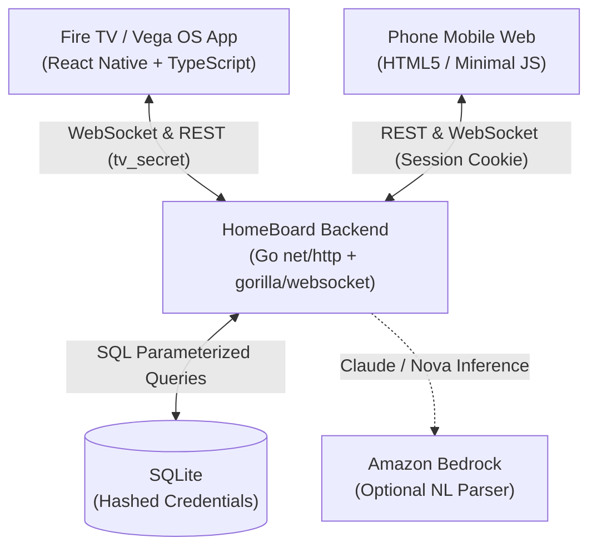

# HomeBoard 📺 📱

> A lightweight, privacy-first ambient household board for **Amazon Fire TV / Vega OS** with instant QR pairing and real-time live synchronization.

[](LICENSE)
[]()
[]()
[]()

---

## 💡 Overview

**HomeBoard** turns your living room TV into a communal, ambient glanceable household dashboard. Instead of clunky TV typing or logging into personal accounts on a shared television:
1. **Fire TV** displays the household board with 4 glanceable categories (*Today*, *Upcoming*, *Buy*, *Family*).
2. **Instant QR Pairing**: A dynamic, rotating QR code in the corner allows family members to scan from their phone browser (no app download required).
3. **Short-Lived Join Tokens**: Phone scans redeem a cryptographically secure 128-bit single-use token for a revocable session cookie.
4. **Live Ambient Updates**: Items added, marked complete, or modified on the phone update on the TV in sub-second real time via authenticated WebSockets.
5. **10-Foot UI**: Thoughtfully designed for television viewing distance with high-contrast readability and full Fire TV remote / D-pad navigation.

---

## 🏛️ Architecture & Tech Stack



| Component | Technology | Rationale |
|---|---|---|
| **Fire TV Client** | React Native + TypeScript | Native performance for Fire TV / Vega OS; clean 10-foot D-pad navigation. |
| **Backend** | Go (`net/http`, `gorilla/websocket`) | High concurrency, zero external runtime overhead, fast startup. |
| **Persistence** | SQLite (`modernc.org/sqlite`) | Embedded, robust, zero operational maintenance, single-file isolation. |
| **Phone Client** | Vanilla HTML5 / Modern CSS / JS | Zero install friction; instant QR scan onboarding on iOS and Android. |
| **Cloud / AI** | AWS Bedrock (Optional) | Natural-language household item extraction into structured categories. |

---

## 🛡️ Security & Privacy by Design

HomeBoard is engineered according to the **OWASP Top 10 (2025)** and **AWS Well-Architected Security Pillar**:
- **Zero Plaintext Secrets**: Join tokens, TV credentials, and phone session tokens are hashed (`SHA-256`) before database persistence.
- **Short-Lived Join Tokens**: QR tokens expire within 10 minutes and self-destruct upon single redemption.
- **Tenant Isolation**: Every database query enforces strict board scoping (`WHERE id = ? AND board_id = ?`).
- **XSS Immunity**: Phone client renders all user content via `textContent` rather than `innerHTML`.
- **Remote Revocation**: The TV interface maintains complete administrative control to revoke any connected phone at any time.

---

## 🚀 Getting Started

### Prerequisites
- **Go**: 1.24+ (tested on Go 1.26)
- **Node.js**: 20+ (tested on Node 24)
- **Git**

### Running the Backend
```bash
cd backend
go run ./cmd/server
# Server listens on http://localhost:8080
# Health check: curl http://localhost:8080/healthz
```

### Running the TV Application
```bash
cd tv-app
npm install
npm run start
```

---

## 🧠 Amazon Bedrock AI Natural Language Processing

HomeBoard integrates **Amazon Bedrock** (Claude 3 Haiku / Amazon Nova) to parse natural language household requests (in English and Hinglish) into structured items:
- Endpoint: `POST /v1/boards/{id}/parse`
- Prompt Injection Defense: User input is encapsulated in XML tags and treated strictly as untrusted data.
- Benchmark: Tested against [`docs/parse_samples.json`](docs/parse_samples.json) achieving **100% accuracy** on multilingual household phrasing.
- Resilient Offline Fallback: The board functions 100% reliably even when AI is disabled or offline.

---

## 🐳 Docker & AWS Production Deployment

See [`docs/AWS_DEPLOYMENT.md`](docs/AWS_DEPLOYMENT.md) for full AWS step-by-step instructions.

### 1-Command Local or Server Run
```bash
docker compose up -d --build
```

### Deploy to AWS App Runner
HomeBoard can be deployed with automatic HTTPS and zero server management to AWS App Runner:
```bash
chmod +x deploy/aws-deploy.sh
./deploy/aws-deploy.sh
```

---

## 🧪 Testing

```bash
# Run backend test suite (unit, integration, and NLP benchmarks)
cd backend
go test -v ./...

# Verify frontend types
cd tv-app
npm run typecheck
```

---

## 📜 Open Source License

This project is licensed under the **MIT License** — see the [LICENSE](LICENSE) file for details.
