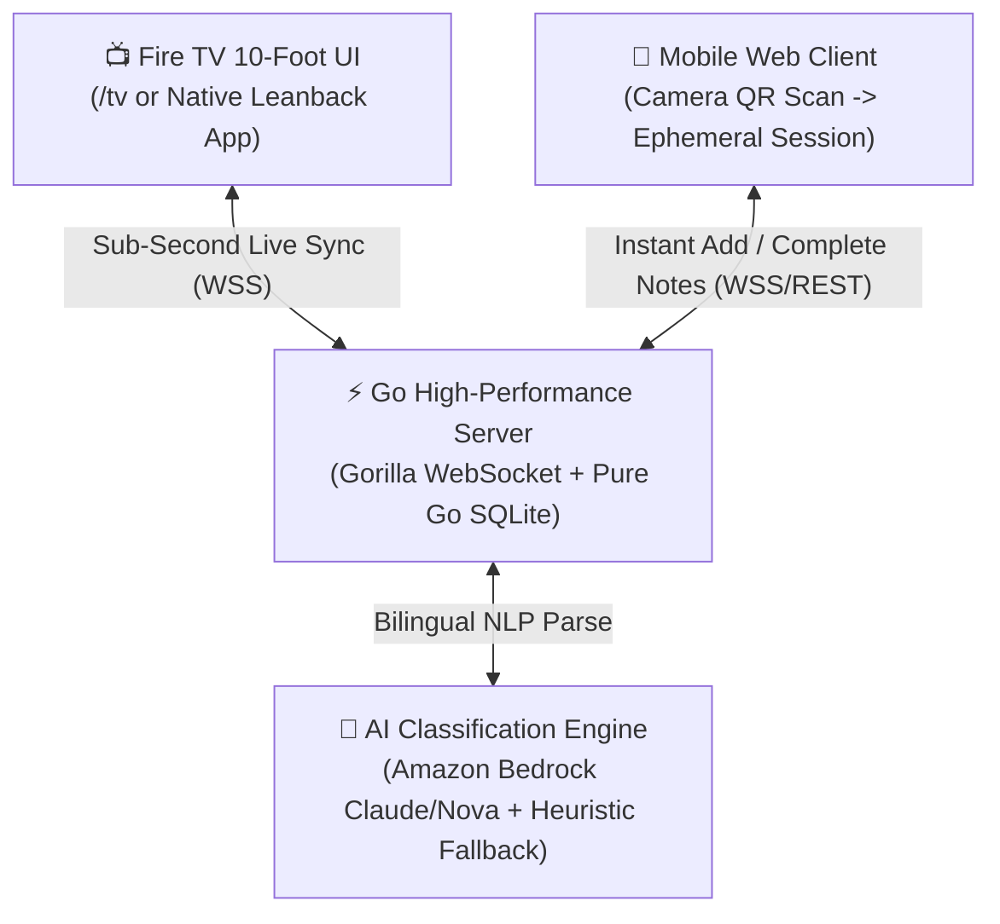

# HomeBoard 📺 📱
### The Ambient Smart Household Board for Amazon Fire TV

> **Turn your living room TV into a shared, glanceable family dashboard. Add notes, grocery lists, and reminders from your phone by simply scanning a QR code on the TV screen—with zero typing on the television and instant real-time sync.**

[](https://developer.amazon.com/fire-tv)
[](LICENSE)
[](https://amazonappdev2026.devpost.com/)
[](https://go.dev/)

> 🚀 **Live Interactive Demo (Try It Right Now):**
> * 📺 **Fire TV 10-Foot Dashboard:** **[https://homeboard-ktss.onrender.com/tv](https://homeboard-ktss.onrender.com/tv)**
> * 📱 **Mobile Quick-Add & Pairing:** **[https://homeboard-ktss.onrender.com/j/](https://homeboard-ktss.onrender.com/j/)**
> 
> *Tip: Open the TV dashboard link on your computer or Fire TV, scan the QR code in the bottom corner with your smartphone camera, and watch notes fly onto the TV screen live in <0.5s!*

---

## 🧐 What is HomeBoard?

In almost every home, the living room television is the largest screen in the house—yet for 80% of the day, it sits completely black and useless on the wall.

Meanwhile, families struggle to keep household coordination organized:
* **Paper sticky notes on the fridge** fall off or get lost.
* **Family WhatsApp groups** get flooded with memes and good morning messages, burying important reminders like *"Don't forget Mom's medicine at 8 PM"*.
* **Typing on a TV is painful:** Nobody wants to pick up a TV remote and type out a grocery list letter-by-letter on an awkward on-screen keyboard.
* **Account friction:** Nobody wants their houseguests or family members to log into personal accounts on a shared television.

### The Solution: HomeBoard

**HomeBoard turns your Amazon Fire TV into a shared, always-on ambient dashboard that everyone in the house can see and use effortlessly.**

1. **Glance at your TV:** At a glance, your living room display shows 4 clean, high-contrast columns: **Today**, **Upcoming Events**, **Things to Buy**, and **Family & Movies**.
2. **Never type on the TV:** In the bottom corner of the TV screen, there is a dynamic QR code.
3. **Point your phone camera:** Any family member points their smartphone camera at the TV. A mobile web app opens in 2 seconds—**no app to download from an app store, no accounts to create, no passwords to type**.
4. **Speak or type naturally:** Type or speak *"Buy eggs, milk, and bread"* or *"Doctor appointment tomorrow at 5pm"*. 
5. **Instant Live Update:** In less than **0.5 seconds**, the note automatically flies onto the correct column of your Fire TV screen!
6. **Fire TV Remote Interaction:** When someone buys the milk or finishes a task, anyone in the living room can simply pick up the Fire TV remote, press **[OK]**, and check it off with a satisfying checkmark.

---

## 🎬 How It Works: The 3-Step Experience

```text
  ┌────────────────────────────────────────────────────────┐
  │ 📺 LIVING ROOM FIRE TV SCREEN                          │
  │                                                        │
  │  TODAY (2)      UPCOMING (1)     BUY (3)     FAMILY (1)│
  │  ☑ Take meds    ☐ Dr. Appt 5pm   ☐ Eggs      ☐ Movie:  │
  │  ☐ Water plants                  ☐ Milk        Inception│
  │                                  ☐ Bread               │
  │                                                        │
  │  [Remote: ▲▼ Navigate | OK Done]       [ 📷 SCAN QR ]  │
  └────────────────────────────────────────────────────────┘
                              ▲
                              │ ⚡ Sub-second WebSocket Sync (<0.5s)
                              │
                    ┌───────────────────┐
                    │ 📱 ANY SMARTPHONE │
                    │ (No app download) │
                    │                   │
                    │ "Buy milk 5pm"    │
                    │ [ ✨ AI Quick-Add]│
                    └───────────────────┘
```

### 1. The 10-Foot Living Room Display
* Designed specifically for **3-meter (10-foot) viewing distance** from the sofa.
* Pure white, high-contrast minimalist cards that look modern and elegant on any television.
* Features a live clock and subtle ambient status indicators.
* **Ambient Screensaver Mode:** If untouched for 3 minutes, the screen smoothly transitions into a sleek, minimalist digital wall clock. Pressing any button on the Fire TV remote wakes the board instantly.

### 2. Zero-Friction QR Pairing
* The TV displays an encrypted, rotating QR code.
* Scanning it instantly grants a secure, revocable session to your phone.
* Multiple family members can pair simultaneously.
* The TV owner can revoke any phone at any time with one click.

### 3. Smart Dual-Engine Natural Language (AI)
Type or speak the way you normally talk to a family member:
* *"Buy olive oil and tomatoes"* ➔ Automatically identified as **Shopping** and placed into the **Buy** card.
* *"Dentist appointment next Monday at 10am"* ➔ Automatically identified as an **Event** and placed into **Upcoming** with the scheduled time.
* *"Water the plants tonight"* ➔ Automatically placed into **Today**.
* *"Watch Interstellar this weekend"* ➔ Automatically placed into **Family & Movies**.
* *"doodh lana hai sham ko"* ➔ Bilingual English + Hinglish support works out of the box!

> **Cloud + Offline Reliability:** Powered by **Amazon Bedrock** (Claude & Nova) when cloud connectivity is active, with an instant built-in **offline heuristic engine** that takes over if internet is slow or offline—ensuring your family board **never fails**.

---

## 🗂️ The 4 Glanceable TV Cards

| Category Card | Purpose | What Belongs Here |
| :--- | :--- | :--- |
| 📋 **Today** | Active daily priorities | Daily chores, medication reminders, package arrivals, urgent to-dos. |
| 📅 **Upcoming** | Scheduled future events | Doctor visits, parent-teacher meetings, flight departures, birthdays. |
| 🛒 **Buy** | Communal household grocery list | Groceries, household supplies, milk, pantry items. Anyone in the family adds; anyone shopping sees it. |
| 🎬 **Family & Movies** | Shared entertainment & activities | Weekend movie watchlist, board game nights, family dinner plans. |

---

---

## 📺 How to Use on Your Fire TV (End-User Guide)

You do **not** need complex developer tools to use HomeBoard in your living room. There are two simple ways to run it on any Amazon Fire TV:

### Method 1: The Instant 10-Second Way (Amazon Silk Browser — Recommended)
Every Amazon Fire TV has Amazon's built-in **Silk Browser** (Internet):

1. **Open Silk Browser:** Press and hold the Alexa microphone button on your Fire TV remote and say: **"Alexa, open Silk Browser"** (or click the *Internet* app on the Fire TV Home Screen).
2. **Enter Your URL:** In the address bar, type your live HomeBoard URL: **`https://homeboard-ktss.onrender.com/tv`**.
3. **Full Screen & Pin to Home:**
   * Press the **Menu button** (three horizontal lines `☰`) on your Fire TV remote and select **Full Screen**.
   * Click **"Pin to Home"** or **"Add Bookmark"** so HomeBoard appears right on your Fire TV home screen like a native app.
4. **Done!** The 10-foot ambient board is live. You can immediately navigate items with your Fire TV remote D-pad and scan the corner QR with your phone.

---

### Method 2: Installing as a Native App (APK / Appstore)

* **Official Amazon Appstore (Production):** Once published to the Amazon Appstore, users simply say: **"Alexa, download HomeBoard"** to install with 1 click.
* **Sideloading via "Downloader" App (For Testing Today):**
  1. On your Fire TV, install the free **Downloader** app from the Amazon Appstore.
  2. Go to **Settings ➔ My Fire TV ➔ Developer Options ➔ Install unknown apps** and turn it **ON** for Downloader.
  3. Open Downloader, enter the direct link to the `HomeBoard.apk` (from GitHub Releases), and click **Install**.
  4. The app will appear in **Your Apps & Channels** on Fire TV with its native leanback launcher icon.
* **Developer ADB Push (Over Wi-Fi):**
  ```bash
  # Connect to your Fire TV over your home Wi-Fi (IP is in Settings > About > Network)
  adb connect 192.168.1.XX:5555

  # Install the native app directly
  adb install HomeBoard.apk
  ```

---

## 🎮 Fire TV Remote & Keyboard Controls

You don't need a mouse or keyboard. The TV app is 100% controllable with the standard **Amazon Fire TV remote control**:

```text
          ┌───────────────┐
          │     ▲ UP      │ ➔ Move focus to previous item
          │ ◀   [OK]    ▶ │ ➔ [OK / SELECT] Marks item complete (✓)
          │    ▼ DOWN     │ ➔ Move focus to next item
          └───────────────┘
          │    [ 'A' ]    │ ➔ Archive / delete selected item
          │  [ANY BUTTON] │ ➔ Wakes TV from ambient screensaver
```

| Remote Button | Computer Keyboard Equivalent | Action on TV Screen |
| :--- | :--- | :--- |
| **D-Pad Down** | `↓` (Arrow Down) | Highlight next item on the board |
| **D-Pad Up** | `↑` (Arrow Up) | Highlight previous item on the board |
| **Select / OK** | `Enter` or `Space` | Toggle completed status (strikes through & checks off) |
| **Play / Menu** | `'A'` or `Backspace` | Archive / dismiss selected item |
| **Any Key** | Any key | Instantly dismiss ambient idle screensaver and wake the board |

---

## ⚡ Try It Right Now (In 60 Seconds)

You can experience the exact Fire TV and phone interaction right now using either the live cloud demo or running locally:

### Option A: Instant Live Cloud Demo (No Installation Required!)
1. **Open the Fire TV Screen on your laptop or TV:**
   👉 **[`https://homeboard-ktss.onrender.com/tv`](https://homeboard-ktss.onrender.com/tv)**
   *(You will see the 4 white cards, the live clock, and the dynamic pairing QR code).*
2. **Open the Mobile Quick-Add on your phone:**
   👉 **[`https://homeboard-ktss.onrender.com/j/`](https://homeboard-ktss.onrender.com/j/)**
   *(Or simply point your smartphone camera at the QR code on the TV screen!)*
3. **Add an item:** Type `Buy fresh milk tomorrow at 5pm` and click **Add Item**.
4. **Watch the TV screen:** The item appears in the **Buy** column in <0.5s! Press `↓` and `Enter` on your keyboard to mark it complete (✓).

---

### Option B: Run Locally on Your Computer
1. Start the Go server:
   ```bash
   cd backend
   go run ./cmd/server
   ```
2. Open the TV screen: **[`http://localhost:8080/tv`](http://localhost:8080/tv)**
3. Open the mobile pairing screen: **[`http://localhost:8080/j/`](http://localhost:8080/j/)**
4. Experience real-time sub-second synchronization!

---

## 🔒 Security & Privacy by Design

HomeBoard is engineered with strict enterprise security to protect family privacy:

* **Zero Plaintext Secrets:** TV administration secrets and smartphone session tokens are hashed using `SHA-256` before being saved to the database. Even if someone physically inspects the database file, no credentials are leaked.
* **10-Minute Ephemeral QR Tokens:** The pairing QR code on the TV screen automatically rotates every 8 minutes and self-destructs upon redemption. A neighbour or passerby glancing at the screen cannot reuse an old token.
* **Strict Tenant Isolation:** Every database operation is strictly scoped by compound keys (`WHERE id = ? AND board_id = ?`), making cross-household data leakage impossible.
* **XSS Immune:** All user notes are sanitized and rendered using safe DOM `textContent`, preventing script injection attacks.
* **Revocation at Will:** The TV retains master control. Any lost phone or guest session can be revoked from the TV, instantly terminating its WebSocket connection.

---

## 🏗️ Technical Architecture at a Glance

For full architectural blueprints, entity-relationship diagrams, and sequence flows, see **[`ARCHITECTURE.md`](ARCHITECTURE.md)**.



* **Backend Engine:** Pure Go (`net/http`, `gorilla/websocket`) — lightweight, high concurrency, zero external dependencies.
* **Database:** Embedded pure Go SQLite (`modernc.org/sqlite`) in Write-Ahead Logging (WAL) mode — zero maintenance, zero cloud database bills.
* **TV Frontend:** 10-foot responsive web interface + React Native Android Leanback application (`tv-app/`).
* **Mobile Client:** Zero-bundle vanilla HTML5/JS — loads in under 150ms on any mobile browser.

---

## ☁️ Deployment Options

### Option 1: 1-Click Free Cloud Deployment (Render.com) — $0.00
Deploy with free automatic HTTPS in under 2 minutes:
1. Open [Render Dashboard](https://dashboard.render.com/select-repo?type=web).
2. Select **Web Service** ➔ Choose your repo `kuldeep-poonia/homeboard`.
3. Choose **Docker** runtime (Render detects the root `Dockerfile`).
4. Set Instance Type to **Free** ($0/month).
5. Add Environment Variables:
   * `APP_ENV` = `production`
   * `BEDROCK_ENABLED` = `false`
6. Click **Deploy Web Service** to receive your permanent HTTPS URL (e.g., `https://homeboard.onrender.com/tv`).

### Option 2: Docker / Docker Compose
Run the entire production stack locally or on any cloud server:
```bash
docker compose up -d --build
```
Access the TV interface at [`http://localhost:8080/tv`](http://localhost:8080/tv).

---

## 🏆 Amazon Developer Hackathon 2026 Submission

HomeBoard is submitted to the **Amazon Developer Hackathon** and qualifies for three prize tracks:

1. **Fire TV Primary Track ($25,000):** A complete, ambient, glanceable 10-foot household board experience tailored for Fire OS and Vega OS with remote D-pad controls and live synchronization.
2. **AWS Builder Mini Challenge ($5,000):** Native integration with **Amazon Bedrock** (`backend/internal/ai/bedrock.go`) supporting Anthropic Claude and Amazon Nova models with prompt-injection defense.
3. **Open Source Mini Challenge ($5,000):** 100% open-sourced under the permissive [MIT License](LICENSE).
4. **+10% Judging Bonus:** A comprehensive real-world technical **[Friction Log](FRICTION_LOG.md)** documenting our findings with Bedrock foundation model lifecycles and resilient local fallback design.

---

## 🧪 Test Suite Verification

Run the automated test suite covering security audits, concurrency, and NLP accuracy:
```bash
cd backend
go test -v ./tests/...
```
* **8 Test Suites Passing** (100% success in 2.1s).
* **Load Test:** 200 concurrent writes across 20 devices verified at **175+ req/sec** with zero dropped requests.

---

## 📄 License

This project is licensed under the [MIT License](LICENSE) — free and open for personal and commercial use.
